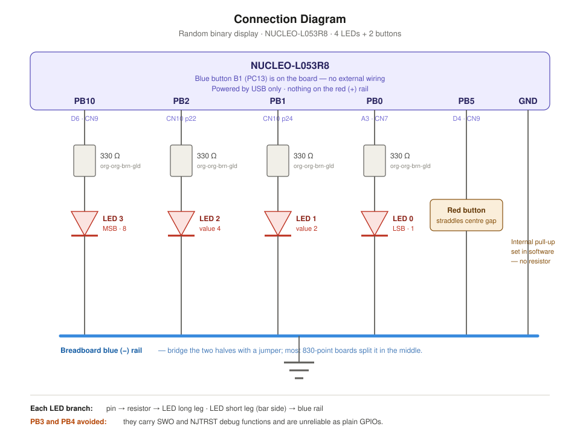
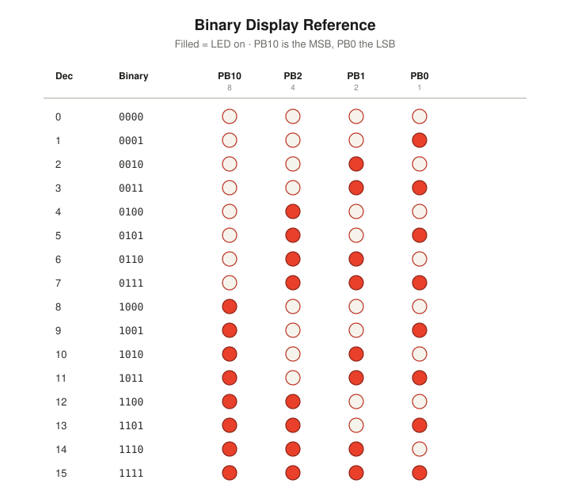
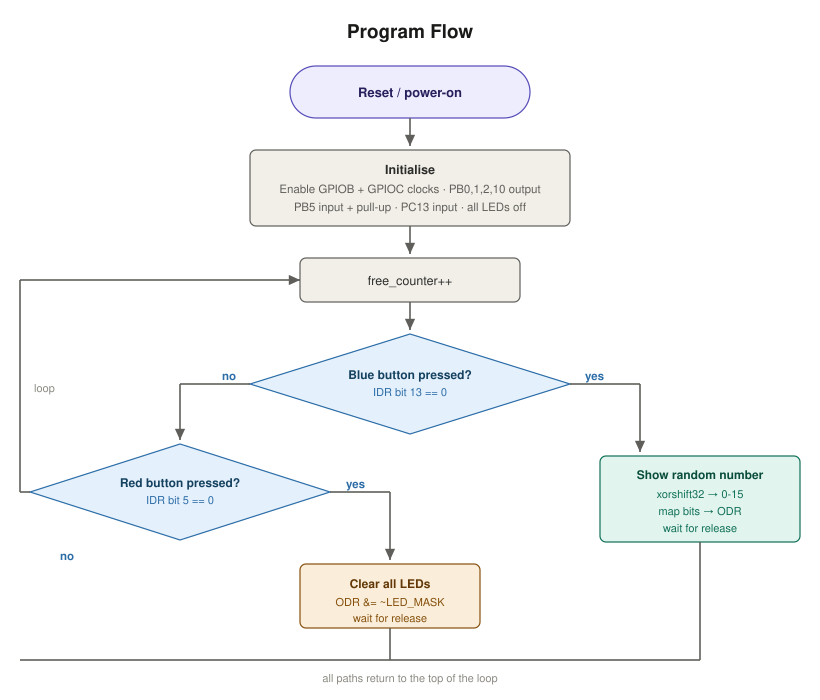

# STM32 Nucleo-L053R8 — Random Binary Display

A bare-metal (register-level) STM32 project for the **NUCLEO-L053R8** board
(STM32L053R8, Cortex-M0+). LEDs display the binary notation of a random number
on a button press, and a second button clears all LEDs.

## Demo

<!-- DEMO_GIF -->
_Demo coming soon._

## Program description

- **Blue button (B1, on-board, PC13)** — generates a random 4-bit number and
  displays its binary notation on the LEDs.
- **Red button (breadboard, PB5)** — turns off all the LEDs.

## Output control method

Output is driven directly through the GPIO **Output Data Register (ODR)** —
no HAL abstraction for the output path. Inputs are read from the **Input Data
Register (IDR)** using a bit-band-style single-bit read macro.

> Note: True ARM bit-banding is a Cortex-M3/M4/M7 feature. The STM32L053R8 uses
> a Cortex-M0+ core (and its GPIO sits on AHB2, outside the classic bit-band
> window), so a shift-and-mask macro reproduces the same single-bit read
> behaviour.

## Hardware / wiring

| Function        | Pin   | Notes                                        |
|-----------------|-------|----------------------------------------------|
| LED bit 0       | PB0   | Output via ODR                               |
| LED bit 1       | PB1   | Output via ODR                               |
| LED bit 2       | PB2   | Output via ODR                               |
| LED bit 3       | PB10  | PB3/PB4 avoided (SWO / NJTRST debug pins)    |
| Blue button B1  | PC13  | On-board pull-up, active-low                 |
| Red button      | PB5   | Internal pull-up, active-low                 |

The 4-bit random value maps bits 0–2 to PB0–PB2 and bit 3 to PB10.

### Connection diagram

Each LED branch: pin → 330 Ω resistor → LED long leg; LED short leg → breadboard
blue (−) rail. The blue button B1 (PC13) is on the Nucleo board itself, and the
red button uses the MCU's internal pull-up (no external resistor).

### Binary display reference

All 16 possible LED patterns (filled = LED on; PB10 is the MSB, PB0 the LSB):

## Randomness

The STM32L053R8 has no hardware RNG. A free-running counter is sampled at the
moment a button is pressed to seed an `xorshift32` PRNG, making the result
effectively unpredictable in practice.

## Program flow

The main loop increments a free-running counter, then polls both buttons via the
IDR each pass; every path returns to the top of the loop.

## Building

Open the project in **STM32CubeIDE** and build, or flash the resulting ELF with
your preferred tool. Source of interest: [`Core/Src/main.c`](Core/Src/main.c).

The `Debug/` build output and IDE `*.launch` files are intentionally excluded
from version control.

## License

This project's own code is released under the [MIT License](LICENSE).

The vendored STMicroelectronics HAL and CMSIS sources under `Drivers/` are
distributed under their respective ST / Arm licenses (see the `LICENSE.txt`
and `License.md` files within those folders).
